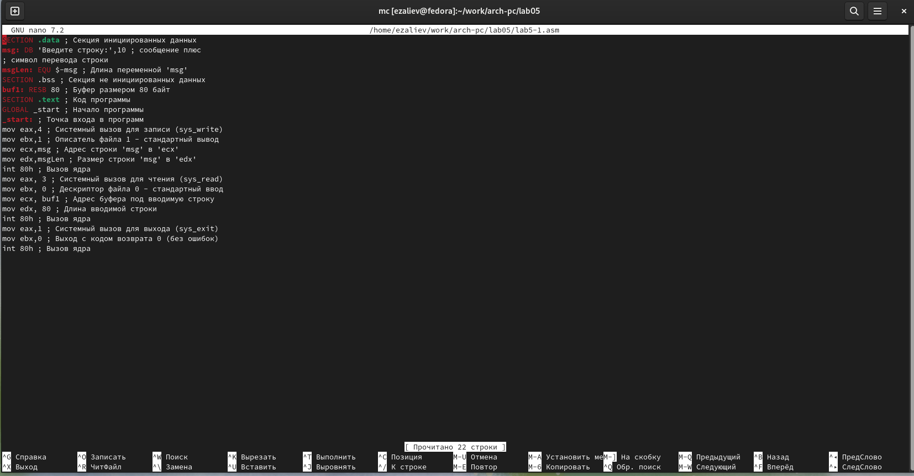
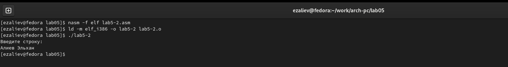

---
## Front matter
title: "Отчет Лабораторной работы №5"
subtitle: "Архитектура компьютеров"
author: "Алиев Эльхан"

## Generic otions
lang: ru-RU
toc-title: "Содержание"

## Bibliography
bibliography: bib/cite.bib
csl: pandoc/csl/gost-r-7-0-5-2008-numeric.csl

## Pdf output format
toc: true # Table of contents
toc-depth: 2
lof: true # List of figures
lot: true # List of tables
fontsize: 12pt
linestretch: 1.5
papersize: a4
documentclass: scrreprt
## I18n polyglossia
polyglossia-lang:
  name: russian
  options:
	- spelling=modern
	- babelshorthands=true
polyglossia-otherlangs:
  name: english
## I18n babel
babel-lang: russian
babel-otherlangs: english
## Fonts
mainfont: PT Serif
romanfont: PT Serif
sansfont: PT Sans
monofont: PT Mono
mainfontoptions: Ligatures=TeX
romanfontoptions: Ligatures=TeX
sansfontoptions: Ligatures=TeX,Scale=MatchLowercase
monofontoptions: Scale=MatchLowercase,Scale=0.9
## Biblatex
biblatex: true
biblio-style: "gost-numeric"
biblatexoptions:
  - parentracker=true
  - backend=biber
  - hyperref=auto
  - language=auto
  - autolang=other*
  - citestyle=gost-numeric
## Pandoc-crossref LaTeX customization
figureTitle: "Рис."
tableTitle: "Таблица"
listingTitle: "Листинг"
lofTitle: "Список иллюстраций"
lotTitle: "Список таблиц"
lolTitle: "Листинги"
## Misc options
indent: true
header-includes:
  - \usepackage{indentfirst}
  - \usepackage{float} # keep figures where there are in the text
  - \floatplacement{figure}{H} # keep figures where there are in the text
---

# Цель работы

Целью данной лабораторной работы является приобретение практических навыков работы в Midnight Commander, освоение инструкций языка ассемблера mov и int.

# Выполнение лабораторной работы

### Изучение Midnight Commander

Открываем Midnight Commander с помощью команды ‘mc’

{#fig:001 width=80%}

{#fig:001 width=80%}

{#fig:001 width=80%}

Перехожу в созданный каталог 

{#fig:001 width=80%}

### Структура программы на языке ассемблера NASM

С помощью функциональной клавиши F4 открываю созданный файл для редактирования в редакторе nano.
Ввожу в файл код программы для запроса строки у пользователя. Далее выхожу из файла (Ctrl+X), сохраняя изменения (Y, Enter).

{#fig:001 width=80%}

Транслирую текст программы файла в объектный файл командой nasm -f elf lab5-1.asm. Создался объектный файл lab5-1.o. Выполняю компоновку объектного файла с помощью команды ld -m elf_i386 -o lab5-1 lab5-1.o. Создался исполняемый файл lab5-1.

{#fig:001 width=80%}

### Подключение внешнего файла

{#fig:001 width=80%}

{#fig:001 width=80%}

{#fig:001 width=80%}

{#fig:001 width=80%}

{#fig:001 width=80%}

{#fig:001 width=80%}

{#fig:001 width=80%}

{#fig:001 width=80%}

Разница между первым исполняемым файлом lab5-2 и вторым lab5-2 в том, что запуск первого запрашивает ввод с новой строки, а программа, которая исполняется при запуске второго, запрашивает ввод без переноса на новую строку, потому что в этом заключается различие между подпрограммами sprintLF и sprint.

# Выполнение заданий для самостоятельной работы

### 1
{#fig:001 width=80%}

{#fig:001 width=80%}

{#fig:001 width=80%}

{#fig:001 width=80%}

### 2

{#fig:001 width=80%}

{#fig:001 width=80%}

{#fig:001 width=80%}

# Выводы

При выполнении данной лабораторной работы я приобрел практические навыки работы в Midnight Commander, а также освоил инструкции языка ассемблера mov и int.

::: {#refs}
:::
