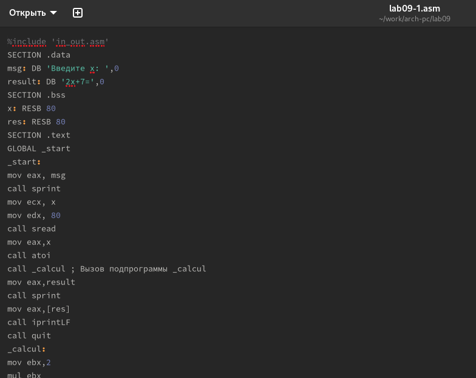
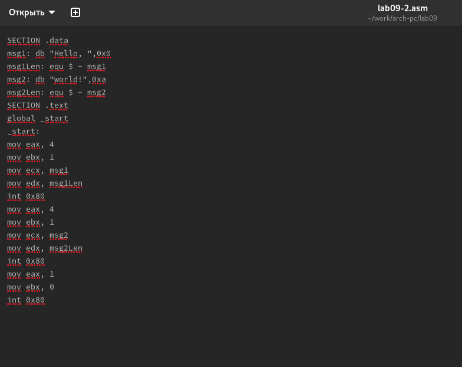
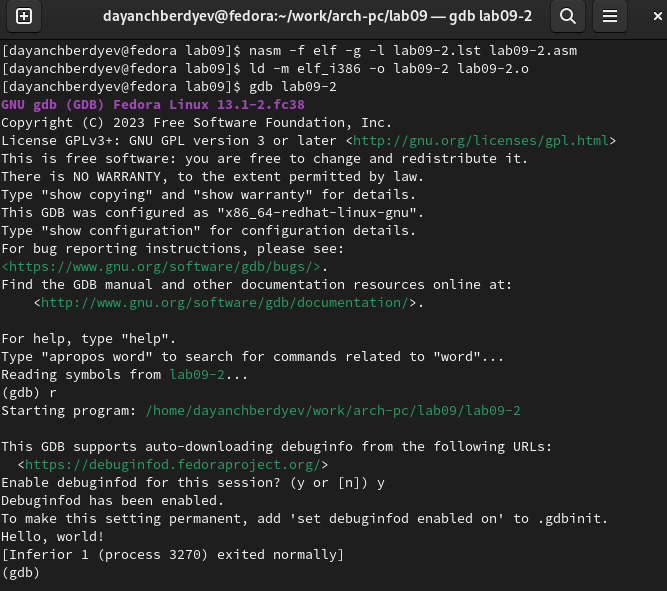
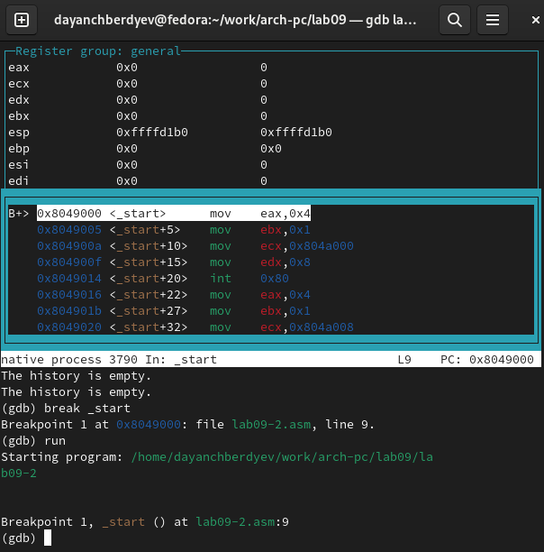
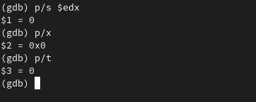
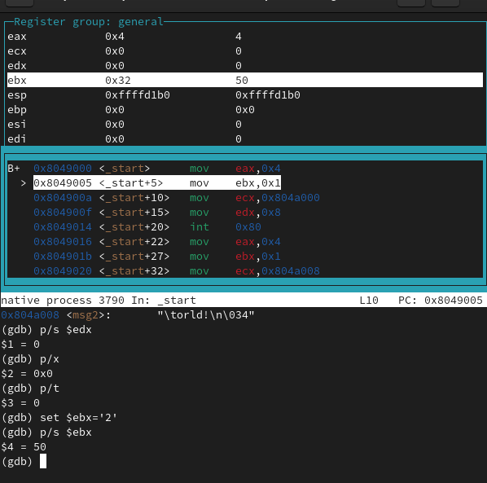
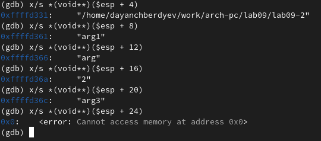
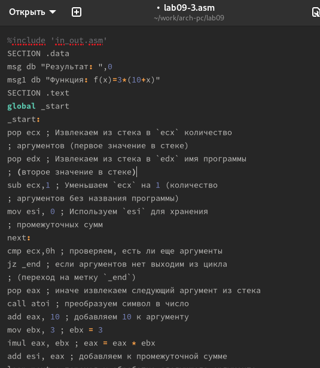
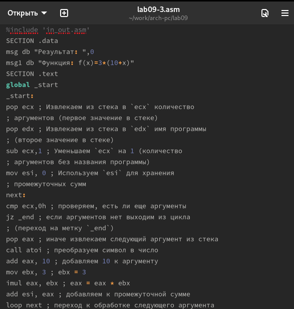
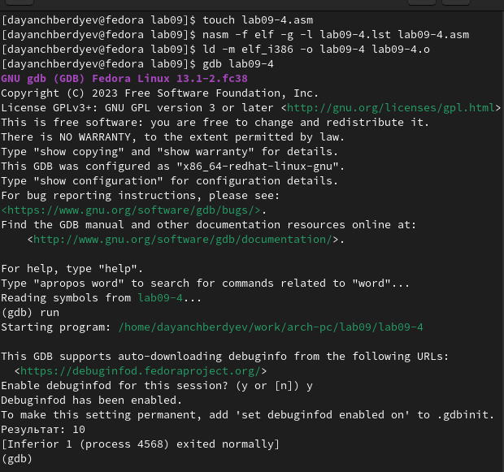

---
## Front matter
title: "Отчёт по лабораторной работе №9"
subtitle: "Дисциплина: архитектура компьютера"
author: "Алиев Эльхан"

## Generic otions
lang: ru-RU
toc-title: "Содержание"

## Bibliography
bibliography: bib/cite.bib
csl: pandoc/csl/gost-r-7-0-5-2008-numeric.csl

## Pdf output format
toc: true # Table of contents
toc-depth: 2
lof: true # List of figures
lot: true # List of tables
fontsize: 12pt
linestretch: 1.5
papersize: a4
documentclass: scrreprt
## I18n polyglossia
polyglossia-lang:
  name: russian
  options:
	- spelling=modern
	- babelshorthands=true
polyglossia-otherlangs:
  name: english
## I18n babel
babel-lang: russian
babel-otherlangs: english
## Fonts
mainfont: PT Serif
romanfont: PT Serif
sansfont: PT Sans
monofont: PT Mono
mainfontoptions: Ligatures=TeX
romanfontoptions: Ligatures=TeX
sansfontoptions: Ligatures=TeX,Scale=MatchLowercase
monofontoptions: Scale=MatchLowercase,Scale=0.9
## Biblatex
biblatex: true
biblio-style: "gost-numeric"
biblatexoptions:
  - parentracker=true
  - backend=biber
  - hyperref=auto
  - language=auto
  - autolang=other*
  - citestyle=gost-numeric
## Pandoc-crossref LaTeX customization
figureTitle: "Рис."
tableTitle: "Таблица"
listingTitle: "Листинг"
lofTitle: "Список иллюстраций"
lotTitle: "Список таблиц"
lolTitle: "Листинги"
## Misc options
indent: true
header-includes:
  - \usepackage{indentfirst}
  - \usepackage{float} # keep figures where there are in the text
  - \floatplacement{figure}{H} # keep figures where there are in the text
---

# Цель работы

Приобретение навыков написания программ с использованием подпрограмм. Знакомство
с методами отладки при помощи GDB и его основными возможностями.

# Выполнение лабораторной работы

Создадим рабочую директорию и файл.(рис. [-@fig:001])

{#fig:001 width=70%}

Напишем программу, имитирующую сложную функцию. Функции назовем _calul и subcalcul.(рис. [-@fig:002])

{#fig:002 width=70%}

Проверим ее работу (рис. [-@fig:003)

{#fig:003 width=70%}

Создадим файл lab09-2.asm и посмотрим, как она работает. Так же проассемблируем его с другими ключами, чтобы была возможность открыть этот файл через gdb. (рис. [-@fig:004])

{#fig:004 width=70%}

{#fig:005 width=70%}

Откроем lab09-2 с помощью gdb. Запустим ее там(рис. [-@fig:006])

{#fig:006 width=70%}

Поставим точку останова(breakpoint) на метке _start. Посмотрим дизассемеблированный код, начиная с этой метки. (рис. [-@fig:007])

{#fig:007 width=70%}

Так же посмотрим как выглядит дизассемблированный код c синтаксисом Intel (рис. [-@fig:008])

{#fig:008 width=70%}

В представлении ATT в виде 16-ричного числа записаны первые аргументы всех комманд, а в представлении intel так записываются адреса вторых аргумантов.

Включим режим псевдографики, с помощью которго отбражается код программы и содержимое регистров.

Посмотрим информацию о наших точках останова. Сделать это можно коротко командой i b (рис. [-@fig:008])

{#fig:008 width=70%}

В отладчике можно вывести текущее значение переменных. Сделать это можно например по имени или по адресу (рис. [-@fig:009])

{#fig:009 width=70%}

Так же отладчик позволяет менять значения переменных прямо во время выполнения программы (рис. [-@fig:010])

{#fig:010 width=70%}

Здесь тоже можно обращаться по адресам переменных(рис. [-@fig:011]). здесь был заменен первый символ переменной msg2 на символ отступа.

{#fig:011 width=70%}

Выоводить можно так же содержимое регисторов. Выведем значение edx в разных форматах: строчном, 16-ричном, двоичном(рис. [-@fig:012])

{#fig:012 width=70%}

Как и переменным, регистрам можно задавать значения.(рис. [-@fig:013])

{#fig:012 width=70%}

Скопируем файл из лабораторной 9, переименуем и создадим исполняемый файл. Откроем отладчик и зададим аргументы. Создадим точку останова на метке _start и запустим программу(рис. [-@fig:014])

{#fig:014 width=70%}

Посмотрим на содержимое того,что расположено по адрессу, находящемуся в регистре esp (рис. [-@fig:015])

{#fig:015 width=70%}

Далее посмотрим на все остальные аргументы в стеке. Их адреса распологаются в 4 байтах друг от друга(именно столько заниемает элемент стека) (рис. [-@fig:016])

{#fig:016 width=70%}

# Задания для самостоятельной работы

Программа из лабороторной 9, но с использованием подпрограмм (рис. [-@fig:017])

{#fig:017 width=70%}

Проверка ее работоспособности(рис. [-@fig:018])

{#fig:018 width=70%}

Просмотр регистров, для поиска ошибки в программе из листинга 

Ошибка была в сторках

add ebx,eax
mov ecx,4
mul ecx
add ebx,5
mov edi,ebx

Правильно работающая программа представлена на (рис. [-@fig:019])

{#fig:019 width=70%}

Проверка корректронсти работы программы, после исправлений (рис. [-@fig:020])

{#fig:020 width=70%}

# Выводы

В результате выполнения работы, я научился организовывать код в подпрограммы и познакомился с базовыми функциями отладчика gdb.

::: {#refs}
:::
